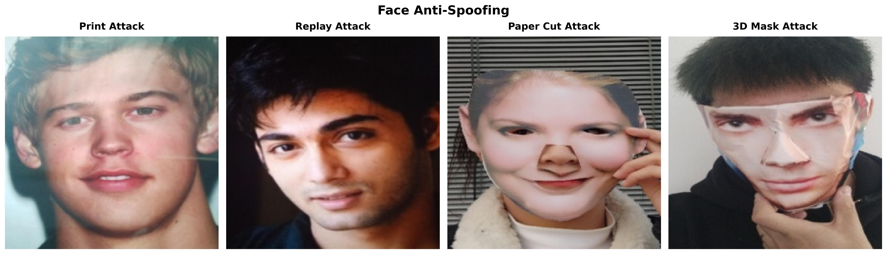
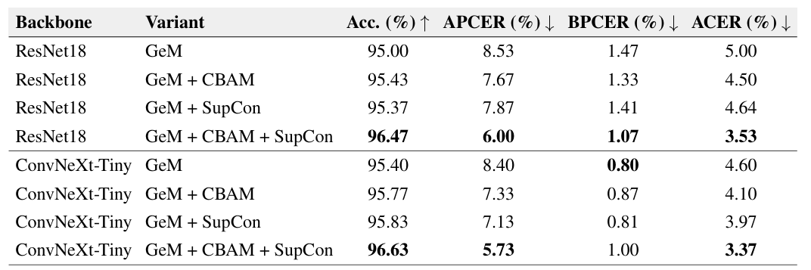

# Face Anti-Spoofing

This repository implements a Face Anti-Spoofing system for binary classification: **Live** vs **Spoof**.

The goal is to detect whether an input face image or video frame comes from a real human face or from a presentation attack, such as a printed photo, replayed video, screen display, paper cut mask, or 3D mask.

---

## Dataset

The main dataset used in this project is a balanced subset of **CelebA-Spoof**.

The dataset is used for training, validation, and testing. It contains both **live** and **spoof** face samples. The spoof samples include several common attack types, such as print attack, replay attack, paper cut attack, and 3D mask attack.

<p align="center">
  
</p>

<p align="center">
  <em>Figure 1. Example samples from the CelebA-Spoof subset.</em>
</p>

---

## Method

This project improves compact deep learning models for Face Anti-Spoofing by combining three main components:

- **GeM Pooling**: improves feature aggregation compared with standard average pooling.
- **CBAM Attention**: helps the model focus on important spoofing artifacts.
- **Supervised Contrastive Learning (SupCon)**: improves feature separation between live and spoof samples during training.

During inference, the SupCon projection head is not used. It is only used during training to improve feature learning. The demo uses the trained classification model for Live/Spoof prediction.

---

## Results

The experiments compare baseline models with improved variants using GeM, CBAM, and SupCon. The best performance is achieved when these components are combined.

<p align="center">
  
</p>

<p align="center">
  <em>Figure 2. Comparison of model variants on the CelebA-Spoof test set.</em>
</p>

---

## Demo

The demo supports both image and video inference.

The inference pipeline is:

```text
Input image/video
→ Face detection
→ Face cropping
→ Live/Spoof prediction
→ Result visualization
```

<p align="center">
  
</p>

<p align="center">
  <em>Figure 3. Demo video result.</em>
</p>

---

## Repository Structure

```text
project/
├── demo/
│   ├── app_gradio.py
│   ├── run_image.py
│   ├── run_video.py
│   ├── config.yaml
│   ├── requirements.txt
│   ├── README.md
│   ├── checkpoints/
│   │   └── resnet18_best.pth
│   ├── src/
│   ├── inputs/
│   └── outputs/
│
├── experiments/
│   ├── baseline/
│   ├── gem/
│   ├── cbam/
│   ├── supcon/
│   └── cbam_supcon/
│
├── assets/
├── archive/
├── .gitignore
└── README.md
```

---

## Quick Start

### 1. Install dependencies

```bash
cd demo
pip install -r requirements.txt
```

### 2. Add checkpoint

Place the trained checkpoint at:

```text
demo/checkpoints/resnet18_best.pth
```

### 3. Run image inference

```bash
python run_image.py --input inputs/images/ --output outputs/images/ --config config.yaml
```

### 4. Run video inference

```bash
python run_video.py --input inputs/videos/test.mp4 --output outputs/videos/test_result.mp4 --config config.yaml
```

### 5. Run Gradio demo

```bash
python app_gradio.py --config config.yaml
```

Then open the local URL shown in the terminal, usually:

```text
http://127.0.0.1:7860
```

---

## Checkpoint

The main checkpoint for demo inference should be placed at:

```text
demo/checkpoints/resnet18_best.pth
```

## Project Status

This repository is intended for academic research, experimentation, and local demo presentation.